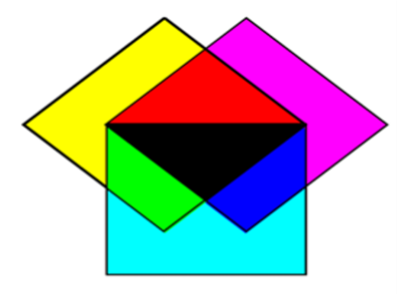
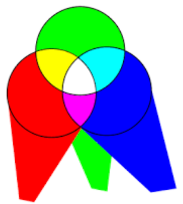
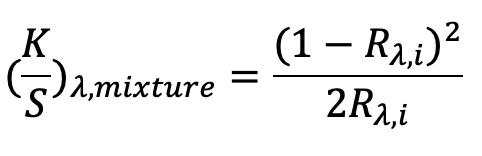
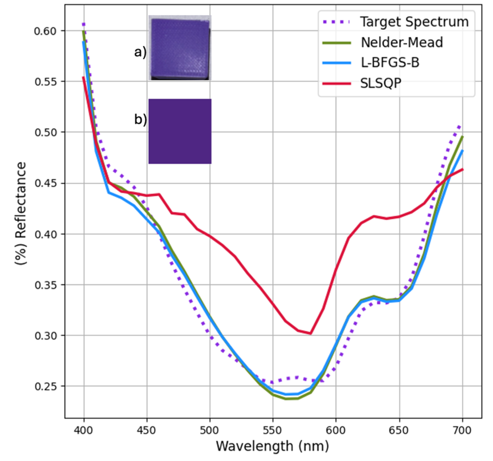
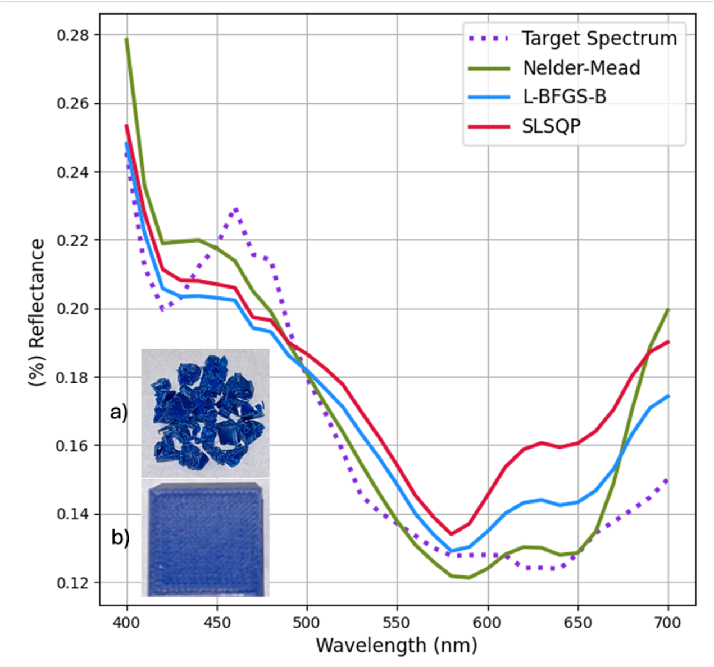
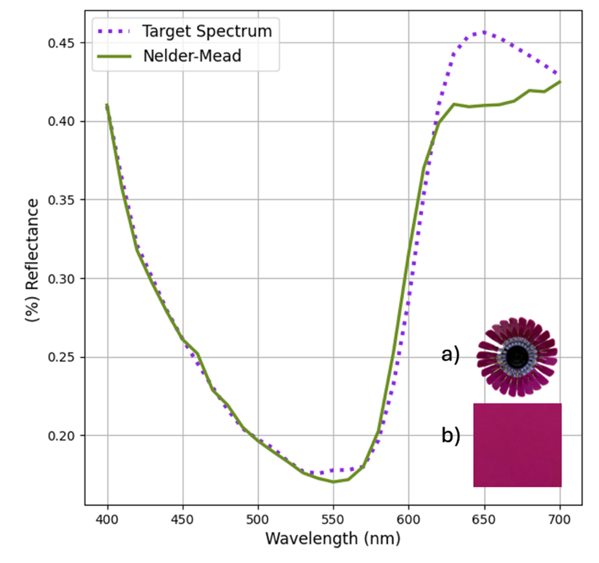

# Creating Custom 3D-Printing Material Colors Using Optical Modeling of Waste Plastic (SpecOptiBlend)

This open-source software aids in identifying the ideal ratio of each spectral data component for the reconstruction of a sample when only its spectral information is available.
Here, it was used to reconstruct Western University's Purple color but, it can be applied to any other color.

## A Background

1. Subtractive Color Mixing:
   - Light interacts with substances (dyes/pigments).
   - Certain wavelengths are absorbed, and others are reflected.
   - Results in perceived colors.
  
Subtractive Mixing:

Additive Mixing:

2. Kubelka-Munk Theory
   - It models how light interacts with an opaque substance.
   - It is used to predict how light is absorbed and scattered.
   - Absorption (K), and Scattering (s)
   - 

## Objectives

To reconstruct the reflectance curve of the target sample by finding the optimized proportion of each color in the mix to reach the lowest color difference and RMS.

- Reflectance ~> XYZ values ~> L*, a*,b*
- Objective Function (Finds proportions to minimize ∆𝐸 𝑎𝑛𝑑 𝑅𝑀𝑆 𝑏𝑎𝑠𝑒𝑑 𝑜𝑛 𝑘𝑢𝑏𝑒𝑙𝑘𝑎−𝑀𝑢𝑛𝑘 𝑣𝑎𝑙𝑢𝑒𝑠  𝑎𝑠 𝑖𝑛𝑖𝑡𝑖𝑎𝑙 𝑔𝑢𝑒𝑠𝑠 simultaneously)
- Add weights to crucial parts of the spectrum. (400-450 nm) and (620-700nm).
- Optimizations to compare:
   - L-BFGS-B
   - Nelder-Mead
   - SLSQP
- Reconstruct using the optimized proportions.

## Results

- Experiment Verification:
  - Reconstructed navy blue and western purple to confirm experiment results.
  - Reconstructed Lego Pink as an industrial Example.
- Impact of Color Variety:
  - Tested reconstruction accuracy using different color sets:
      - Reconstructing both target colors with only four colors: cyan, magenta, black, and green.
- Software Testing:
   - Utilized online color pickers to initiate reconstruction with RGB values.

1. Reconstruction of the Western Purple  using three optimization algorithms.
    - the reconstructed color using the plastics and Nelder-Mead method.  
    - the original purple used to reproduce.

2. Reconstruction of the Navy Blue using three optimization algorithms (8 initial colors).
    - the reconstructed color using the plastics and Nelder-Mead method.  
    - the original purple used to reproduce.

3. Reconstruction of the Lego Pink using the optimized algorithm (8 initial colors). (Nelder-Mead)

##Conclusion
1. Nelder-Mead Optimization provides the closest results to actual colors compared to other algorithms.
2. Limitations of Online RGB Values:
  -  Online RGB lacks spectral data, limiting its use in precise color mixing returning a DeltaE of 17 for Western Purple.
  -  Essential for initial reconstructions; comparison samples may not be directly available.
3. A greater number of colors improves accuracy due to enhanced data availability at each wavelength.

